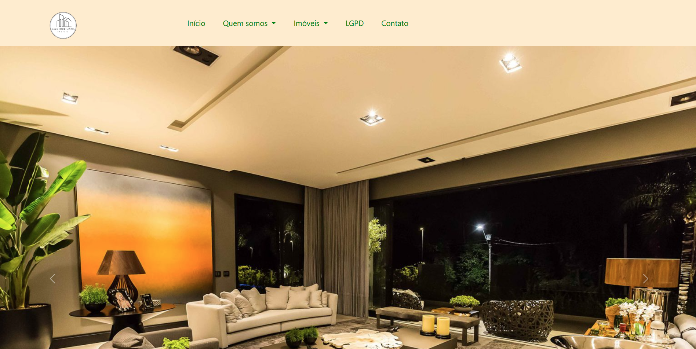
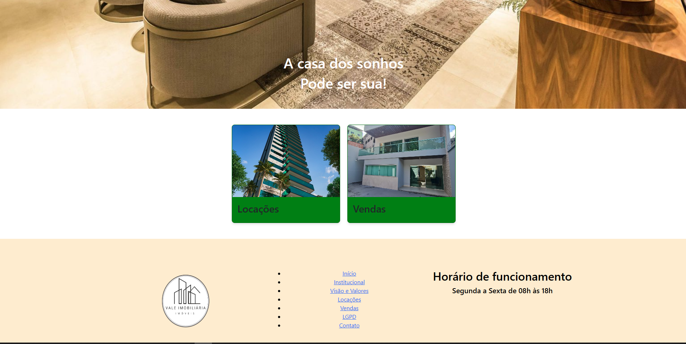
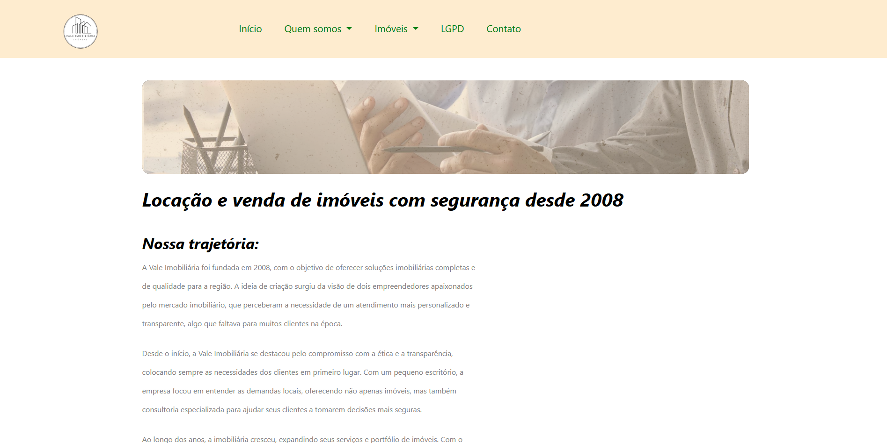
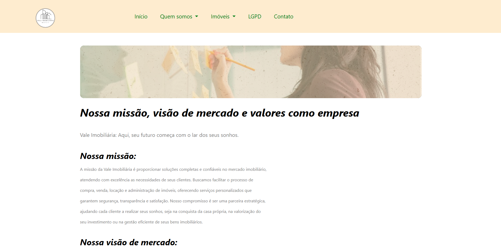
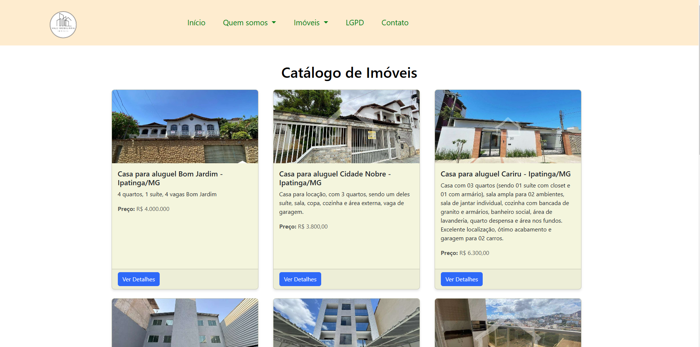
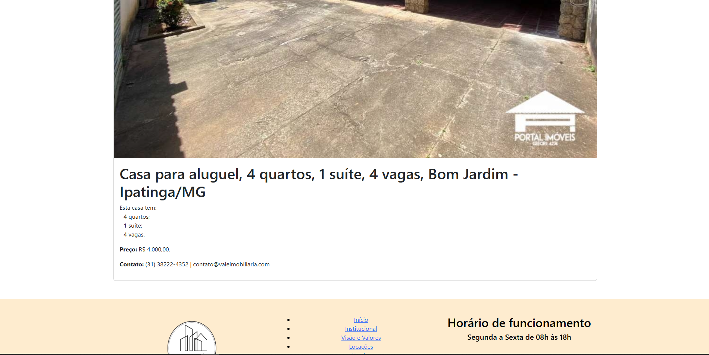
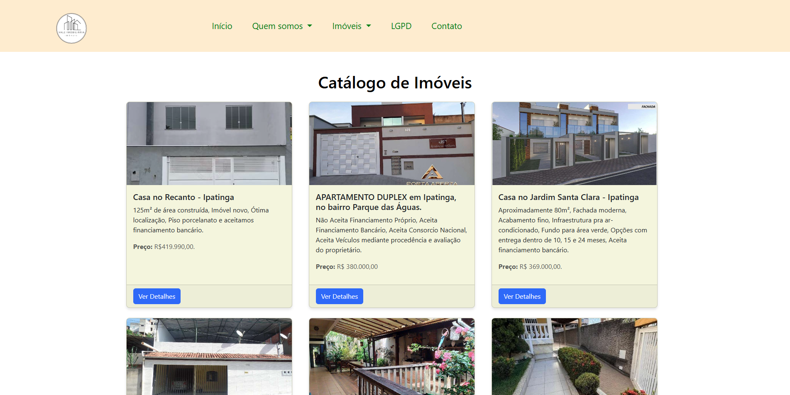
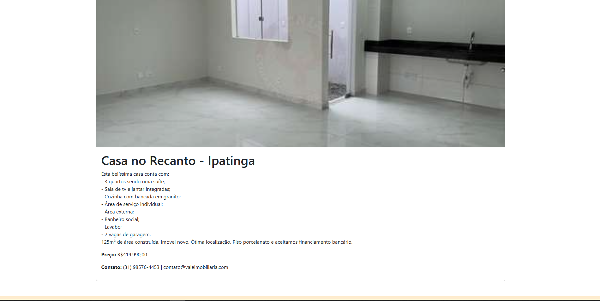
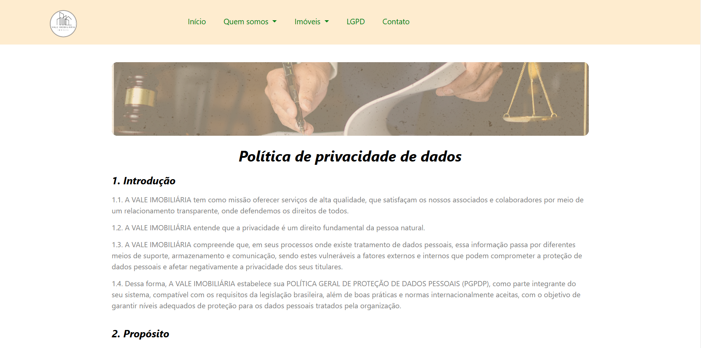
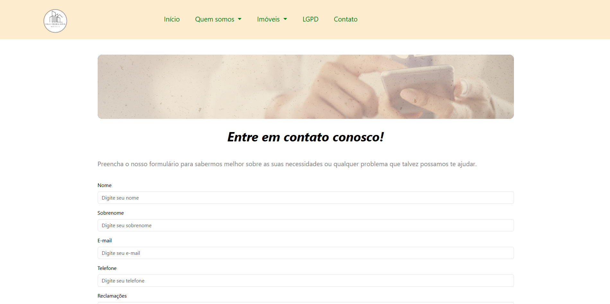

# Vale-Imobiliaria

# README - VALE IMOBILIÁRIA

## Etapas Implementadas
### 1. Criação da Estrutura Básica do HTML:

- Definimos a estrutura básica de páginas como Início, Institucional, Vendas, Locações, LGPD, Contato, com links internos para navegação.

### 2. Desenvolvimento do Menu de Navegação:

- Implementação de um menu de navegação fixo, com a utilização do Bootstrap 5 para facilitar a responsividade.

- Criação de submenus no menu de navegação para a seção "Quem somos" e "Imóveis" (com links para Locação e Vendas).

### 3. Carrossel de Imagens na Página Principal:

- Adicionamos um carrossel de imagens interativas para destacar imóveis e promoções da imobiliária.

### 4. Exibição de Imóveis em Cards:

- Utilizamos a estrutura de cards do Bootstrap para exibir imóveis disponíveis para venda e locação, com imagens e informações destacadas.

### 5. Rodapé (Footer):

- O rodapé contém links úteis, informações de contato, e horários de funcionamento, além de ser responsivo.

### 6. Design Responsivo:

- Utilização das classes responsivas do Bootstrap para garantir que o site funcione bem em diferentes dispositivos (desktop, tablet, smartphone).

### 7. Logomarca da Imobiliária:

- A logomarca da VALE IMOBILIÁRIA foi criada e inserida nas páginas para reforçar a identidade visual da empresa.

## Recursos Utilizados

- HTML5: Estrutura básica do site.
- CSS3: Estilos personalizados, incluindo cores e layout.
- Bootstrap 5: Framework utilizado para facilitar o design responsivo e componentes interativos como o menu e o carrossel.
- JavaScript (Bootstrap): Para adicionar interatividade ao carrossel e outros elementos dinâmicos.
- Imagens: Arquivos de imagem foram usados para ilustrar imóveis e outros elementos visuais do site.

## Backlog (Tarefas Futuras)

1. Formulários de Contato:

- Criar e implementar formulários de contato para solicitações de informações sobre imóveis e outros serviços.

2. Sistema de Cadastro de Imóveis:

- Implementar um sistema para que a imobiliária possa adicionar, editar e remover imóveis da plataforma.

3. Sistema de Busca de Imóveis:

- Adicionar funcionalidade de busca de imóveis com filtros (localização, preço, tipo de imóvel).

4. Sistema de Login para Usuários:

- Criar áreas restritas para os administradores da imobiliária, onde possam gerenciar os imóveis, usuários e outras funcionalidades.

5. Otimização de Performance:

- Melhorar o tempo de carregamento das páginas, principalmente as imagens dos imóveis, utilizando técnicas de lazy loading.

6. SEO (Search Engine Optimization):

- Melhorar o SEO do site para garantir uma boa indexação nas ferramentas de busca, como o Google.

7. Integração com Redes Sociais:

- Adicionar botões de compartilhamento nas redes sociais para promover imóveis e ações promocionais.

## Conclusão

O site da VALE IMOBILIÁRIA foi desenvolvido com sucesso, criando uma plataforma moderna e responsiva, oferecendo uma experiência de navegação agradável para os usuários. A utilização de Bootstrap 5 e CSS3 garantiu que o site fosse não apenas visualmente atraente, mas também funcional em dispositivos móveis. A criação da logomarca contribuiu para o fortalecimento da identidade visual da empresa.

